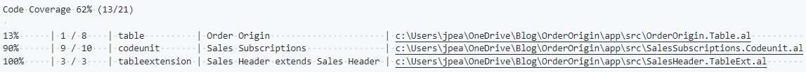
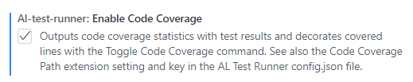
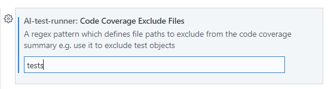

# Code Coverage
AL Test Runner can calculate code coverage statistics when you run your tests. Summarise the number of lines that have been hit by your test code per object and see a coverage percentage above each method right in the editor.

## Summary
With code coverage enabled a summary of the coverage of the objects which have been hit by your tests will be displayed when you run tests.

The code coverage details are downloaded in a json file and stored in the .altestrunner folder of your test project.

The path to the source file is also shown so that you can ```Alt + Click``` to open the source file in the editor.

  

## Toggle Code Coverage
With code coverage stats downloaded you can toggle highlighting the lines which were hit.

Code coverage statistics are kept for:
- the **previous** test run
- the last time **all tests** in the project were run

You can toggle the code highlighting between "Off", "Previous" and "All". The highlighting mode is displayed in the status bar. Toggle the display:
- by clicking on the Code Coverage mode in the status bar
- using the ```Toggle Code Coverage``` command from the command palette (```Ctrl + Alt + C```)
- clicking on the code coverage code lens (see below)

  

### Code Coverage Code Lens
A code lens is displayed above each method with the % coverage the last time **all tests** were run. Clicking on this code lens will toggle the display between Off and All.

# Setup
## Test Runner Service
Make sure that you have the [Test Runner Service](test-runner-service.md) app installed and your testRunnerServiceUrl entered in the AL Test Runner config file.

## Extension Settings
Next, enable the ```Enable Code Coverage``` setting in the extension settings.
  

Optioally, you can also enter a regex expression in the ```Code Coverage Exclude Files``` setting. Any files with paths which are matched by this expression will not be included in the code coverage statistics.

  

In this example, I am excluding any objects which have the "tests" in their path. This will prevent my test library methods and the tests themselves from showing in the code coverage summary.