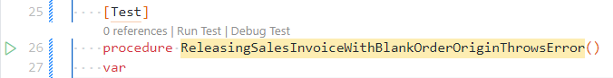

# Debugging Tests
You can debug your tests using the Debug Test code lens, the test icon in the gutter, with the Debug Test command from the command palette or with the `Ctrl + Alt + D` keyboard shortcut.



## Launch Configuration
Before you can debug tests you need to have a launch configuration, with request = attach, to attach the debugger to your server.

It will look something like this. In my example I am attaching to a local docker container called **bc**.

```
{
    "name": "attach bc",
    "type": "al",
    "request": "attach",
    "environmentType": "OnPrem",
    "server": "http://bc",
    "serverInstance": "BC",
    "authentication": "UserPassword",
    "breakOnError": true,
    "breakOnRecordWrite": false,
    "enableSqlInformationDebugger": true,
    "enableLongRunningSqlStatements": true,
    "longRunningSqlStatementsThreshold": 500,
    "numberOfSqlStatements": 10,
    "breakOnNext": "WebServiceClient",
    "tenant": "default"
}
```

When you run debug a test AL Test Runner which check whether a debugger is already attached and if not will attempt to attach to the server specified in the first launch configuration (of request = attach) in launch.json for the project.

## Test Runner Service
Your Docker container must also have the [**Test Runner Service**](test-runner-service.md) app installed. This app provides a REST web service which AL Test Runner uses to run tests.

For a local container you should be able to install the app with the ```Install Test Runner Service``` command in Visual Studio Code.

For remote containers you will need to download the app from GitHub at [https://github.com/jimmymcp/test-runner-service/raw/master/James%20Pearson_Test%20Runner%20Service.app](https://github.com/jimmymcp/test-runner-service/raw/master/James%20Pearson_Test%20Runner%20Service.app).

### testRunnerServiceUrl

Once you have installed the app you need to set the URL that the REST endpoint can be reached at.

Open the config.json file in the .altestrunner folder (or use the ```Open Config File``` command from the command palette). Set the correct URL for the service in the **testRunnerServiceUrl** key.

Note that the URL must include both the company name and the tenant (if your container was creating in multi-tenant mode). As example of the URL is:

```
http://containername:7048/BC/ODataV4/TestRunner?company=My%20Company&tenant=default
```

Replace ```containername``` with the name of your container. For a remote container (hosted on a different machine) this URL will be different and you will need to ensure that the OData services port is accessible.

For more details on configuring Business Central for OData services [see here](https://docs.microsoft.com/en-us/dynamics365/business-central/dev-itpro/administration/configure-server-instance#ODataServices).

# Video
<iframe width="560" height="315" src="https://www.youtube.com/embed/OYige7OLmu4" title="YouTube video player" frameborder="0" allow="accelerometer; autoplay; clipboard-write; encrypted-media; gyroscope; picture-in-picture" allowfullscreen></iframe>