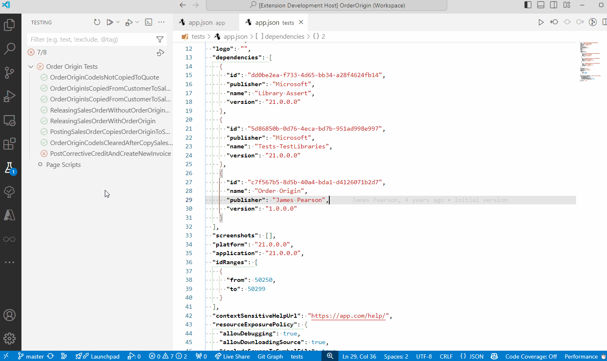

# Export Tests to CSV
AL Test Runner adds a context menu item in the Test Explorer view, "Export Tests as CSV".



Right click on the test that you want to export and select "Export Tests as CSV". AL Test Runner will read the code of your test and look for lines starting with ```//[GIVEN]```, ```//[WHEN] ``` or ```//[THEN]```.

The text following these tags will be exported to the CSV file in a format which is suitable for importing into Test Plans in Azure DevOps (see here: [https://learn.microsoft.com/en-us/azure/devops/test/bulk-import-export-test-cases?view=azure-devops#import-test-cases](https://learn.microsoft.com/en-us/azure/devops/test/bulk-import-export-test-cases?view=azure-devops#import-test-cases)).

If you select a test codeunit to export then the steps of all the tests belonging to that test codeunit will be exported to the CSV file.