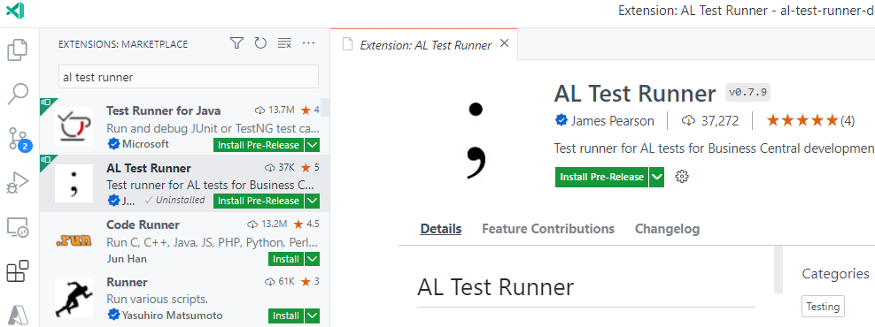

# Intro
AL Test Runner is an extension for Visual Studio Code to help you write and run automated tests for Microsoft Dynamics 365 Business Central.

Get code lenses for [running](running-tests.md) and [debugging tests](debugging-tests.md). See an overview of your test codeunits and tests in VS Code's Test Explorer panel. See [code coverage](code-coverage.md) statistics and [map which tests are calling each method](test-coverage.md). All without leaving VS Code.

# Install
Download and install the extension from the Extension Marketplace from within Visual Studio Code.

Select between the release (stable) version and the pre-release version which has the latest features first.

# Contributing
AL Test Runner is open source. You can find the code at [https://github.com/jimmymcp/al-test-runner](https://github.com/jimmymcp/al-test-runner). Use GitHub Issues to report problems or feature requests.

The source for these docs are also on GitHub here: [https://github.com/jimmymcp/al-test-runner-docs](https://github.com/jimmymcp/al-test-runner-docs). To contribute you can create a pull request with your suggestions. You can also use the "Improve this Doc" links on the right of the pages.

<iframe width="560" height="315" src="https://www.youtube.com/embed/I2vNBkyA_-0" title="YouTube video player" frameborder="0" allow="accelerometer; autoplay; clipboard-write; encrypted-media; gyroscope; picture-in-picture" allowfullscreen></iframe>