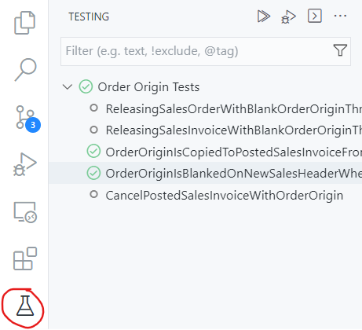
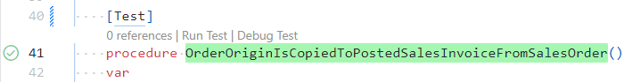
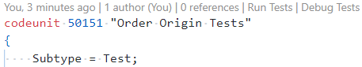
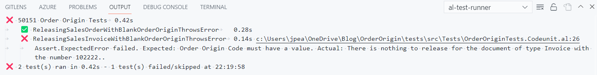
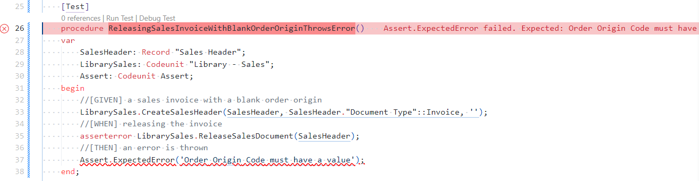

# Test Explorer
When activated the extension scans the files in your workspace for test codeunits and methods. Tests are added to the Test Explorer pane, grouped by the test codeunit that they are in. 

  

The Test Explorer gives the ability to run, debug and go-to tests. You can run or debug:
- All the tests in a codeunit by clicking the icons at the codeunit level
- Individual tests by clicking the icons on a single test
- A selection of tests
- All tests in the workspace with the icons at the top of the pane

(https://jpearson.blog/2021/09/01/test-explorer-in-visual-studio-code/)Use the textbox to filter tests by their name, filter by the last result and reorder how the test are displayed in various ways.

For more information see: [https://jpearson.blog/2021/09/01/test-explorer-in-visual-studio-code/](https://jpearson.blog/2021/09/01/test-explorer-in-visual-studio-code/)

# CodeLens Actions
When you write test methods the extension will recognise them and add CodeLens actions to run or debug the test. Simply click on the command to start running or debugging that one test.

The test name will be highlighted in different colours depending on the result the last time that the test was run (success, failure or no result). The colours can be changed in the extension settings.



Actions are also added at the top of a test codeunit file to run or debug all the tests in that codeunit.



# Keyboard Shortcuts
You can also use the following [keyboard shortcuts](keyboard-shortcuts.md) to run or debug tests. Keyboard shortcuts can be configured.

Command | Shortcut
-- | --
Run the current test (the last test declared above the cursor) | ```Ctrl + Alt + T```
Debug the current test | ```Ctrl + Alt + D```
Run all tests | ```Ctrl + Alt + Shift + T``` or ```Ctrl + ; A```

# Results
AL Test Runner creates a new terminal called al-test-runner to run commands from the [BCContainerHelper](https://www.powershellgallery.com/packages/BcContainerHelper) PowerShell module.

The tests are run in your Docker container and the results downloaded to an xml file.

The results are stored in the .altestrunner/Results folder, the test results are shown in an Output window and the status of each test updated in the Test Explorer window.

  

If tests have failed a link to the declaration of the failing test will also be displayed so that you can easily open an editor to it.

  

The line of the test which led to the error will be highlighted with a red wavy underline. You can change the CSS decoration for the failing line with the _Failing Line Decoration_ extension setting.