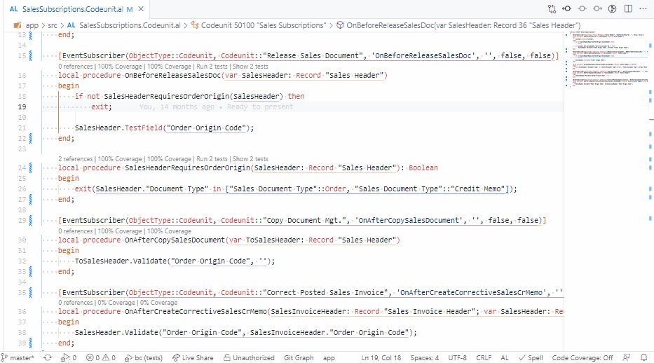
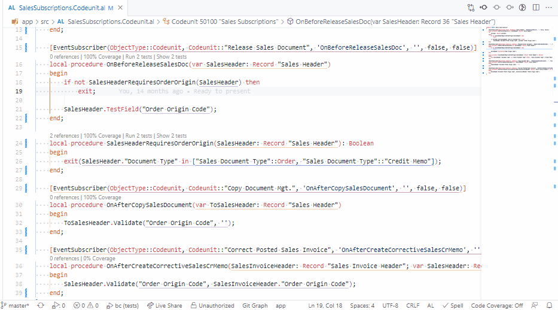

# Test Coverage
AL Test Runner can build a map between your tests and the methods which they call in other objects. This information can be used 

# Code Lens
For each method a code lens will be displayed with the number of tests which call that method.

## Show Tests
Use the ```"Show x Tests"``` code lens to display the names of the test methods which call this method.

You can ```Alt + Click``` on the file path to jump to the declaration of the test method.



## Run Tests
Use the ```Run x Tests``` code lens to run the tests which are related to this method. A new test run will be started for the test which are related to this method.



# Updating the Map
The map is updated when you run a **single** test with code coverage enabled. AL Test Runner will scan the code coverage file to find which objects and methods were hit by your test and store that information in a *testCoverage.json* file in the .altestrunner folder in your test project.